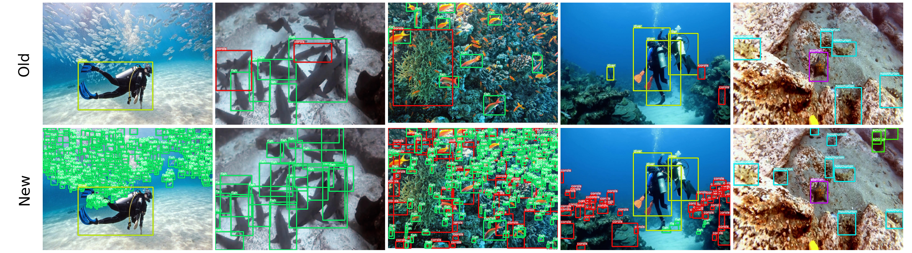

# RUOD-R: A High-Fidelity Re-Annotated Benchmark for Underwater Object Detection

This repository reflects the work presented in the paper:
[Awad et al., *RUOD-R: A High-Fidelity Re-Annotated Benchmark for Underwater Object Detection*](https://ieeexplore.ieee.org/document/11483160) which represents **revised** object detection annotations (RUOD-R) for the [Real-world Underwater Object Detection (RUOD)](https://github.com/xiaoDetection/RUOD) dataset. The train/test splits match the original release. Also, file names, image IDs, and image resolutions are unchanged.

RUOD-R has about **3.5×** more instance annotations than original RUOD over the same 14,000 images and the same 10 classes.




## Layout

```
Annotations/
├── RUOD annotations/          # Original RUOD (reference)
│   ├── instances_train.json
│   └── instances_test.json
├── RUOD-R/
│   ├── COCO/                  # Full re-annotation
│   └── YOLO/                  # YOLO.zip, classes.txt, data.yaml
└── Filtered RUOD-R/           # Subset of images/labels
    ├── COCO/
    └── YOLO/

Figures/                       # Visualizations for this repo
Labelers assignment sheet/     # Annotator assignments & labeling log (xlsx)
```

## Class Distribution Across RUOD Annotation Versions


*Figure: Class distribution across the three UOD annotation versions (RUOD, RUOD-R, and Filtered RUOD-R).*

## Images

This repository provides annotations only; **it does not include the RUOD images.** Download the image archives from the [RUOD dataset repository](https://github.com/xiaoDetection/RUOD).

**Filtered RUOD-R:** For a more balanced label distribution and a more practical training/testing set, we create a filtered version of the revised dataset by excluding images with **more than 100** bounding boxes per image. The resulting filtered dataset has only 302 fewer images, but over 70k fewer instances (bounding boxes) compared with RUOD-R.

## Formats

- **COCO:** standard fields; bounding boxes are `[x_min, y_min, width, height]` in pixels (top-left origin).
- **YOLO:** one row per object: `class_id x_center y_center width height` with all coordinates normalized to `[0, 1]`; `class_id` is COCO `category_id` minus 1.

## Annotation utilities

If you want to modify the annotations, for example after changing image resolution, or filtering images by bounding-box counts, you can use the [annotation utilities](https://github.com/Ali-Awad/Annotations-Toolkit) in this repository.

## Citation

If you use RUOD-R, please cite this paper:

```bibtex
@ARTICLE{11483160,
  author={Awad, Ali and Saleem, Ashraf and Aljnadi, Yaman and Lucas, Evan and Paheding, Sidike and Havens, Timothy C.},
  journal={IEEE Access}, 
  title={RUOD-R: A High-Fidelity Re-Annotated Benchmark for Underwater Object Detection}, 
  year={2026},
  volume={},
  number={},
  pages={1-1},
  keywords={Filtering;Feedback;Filters;Circuits;Location awareness;Protocols;Mobile communication;Communication systems;Pixel;Electronic mail;Underwater object detection;Image enhancement;Dataset re-annotation;Bounding box quality;Label noise;Deep learning;Marine robotics;Benchmark evaluation},
  doi={10.1109/ACCESS.2026.3685121}}
```


Because RUOD-R builds on the Real-world Underwater Object Detection (RUOD) benchmark, you should also cite the original RUOD dataset paper (*Rethinking general underwater object detection: Datasets, challenges, and solutions*):

```bibtex
@article{fu2023rethinking,
  title={Rethinking general underwater object detection: Datasets, challenges, and solutions},
  author={Fu, Chenping and Liu, Risheng and Fan, Xin and Chen, Puyang and Fu, Hao and Yuan, Wanqi and Zhu, Ming and Luo, Zhongxuan},
  journal={Neurocomputing},
  volume={517},
  pages={243--256},
  year={2023},
  publisher={Elsevier}
}
```
